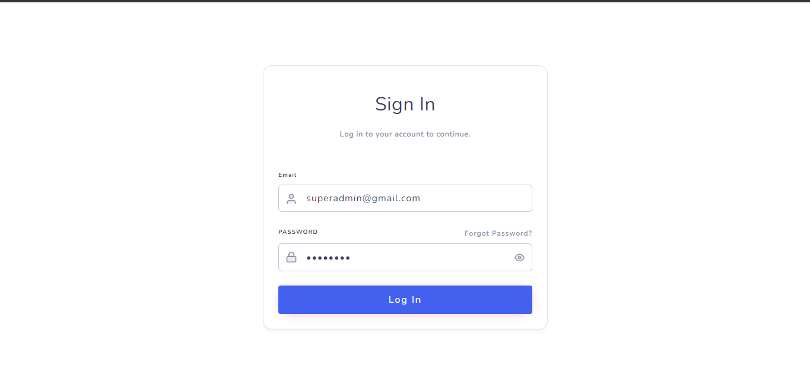
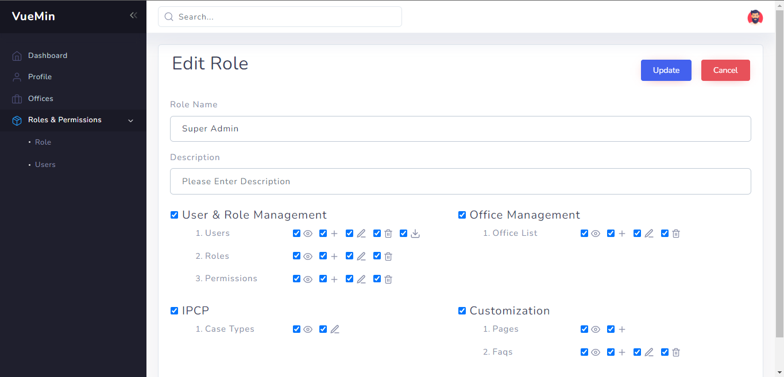
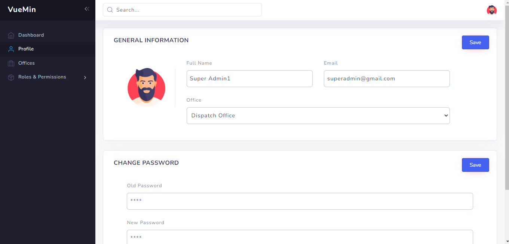
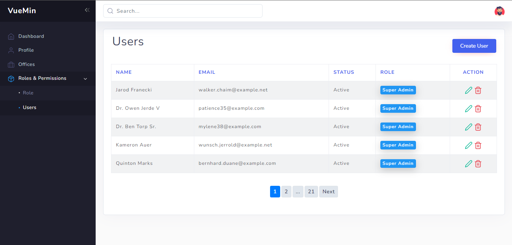

# VueMin - Zero Config Admin Boilerplate with Vue, Laravel and Sanctum

Vuemin is a zero-config Admin boilerplate with Vue, Laravel Sanctum and comes with excellent user, office , role management and  `ACL` features out of the box. Start your next big project with vuemin, focus on building business logic, and save countless hours of implementing boring user and role management again and again
## Preparation
You need to install [node](https://nodejs.org/) and [git](https://git-scm.com/) locally. The project is based on [ES2015+](https://es6.ruanyifeng.com/), [vue](https://cn.vuejs.org/index.html), [vuex](https://vuex.vuejs.org/zh-cn/), [vue-router](https://router.vuejs.org/zh-cn/), [vue-cli](https://github.com/vuejs/vue-cli) , [axios](https://github.com/axios/axios) and [element-ui](https://github.com/ElemeFE/element), all request data is simulated using Laramin backend API.
Understanding and learning this knowledge in advance will greatly help the use of this project.


## Features

```
- Cork Admin Template
- Login / Logout
- Laravel Pagination
- Dynamic Route Handle based on ACL

- Roles and Permission
  - Manage roles and assign permission
  - User management and assign roles with special permission as extra

- Office Management
  - Manage office with JURISDICTION wise 

- Manage Profile
  - change password
  - change avatar image and basic information

- Error Page
  - 401
  - 404

- Components
  - Acl Components
  - Feather Icon components
```





## Getting started

```bash
# clone the project
git clone https://gitlab.com/uzzalh-personal/admin-panel/vuemin.git

# enter the project directory
cd vuemin

# install dependency
npm install

# develop
npm run serve
```

This will automatically open http://localhost:1010

## Build

```bash
npm run build
```
